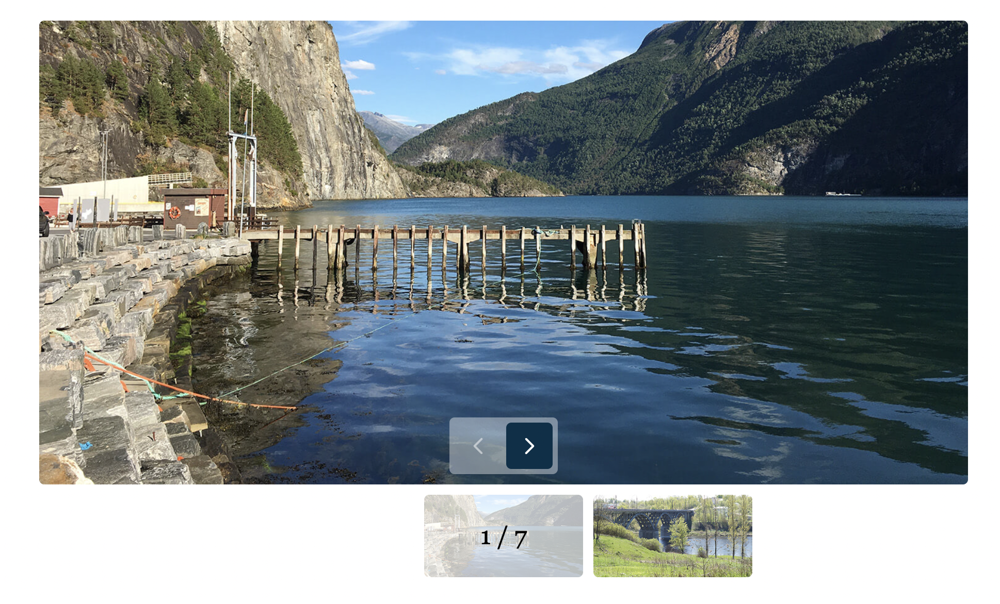
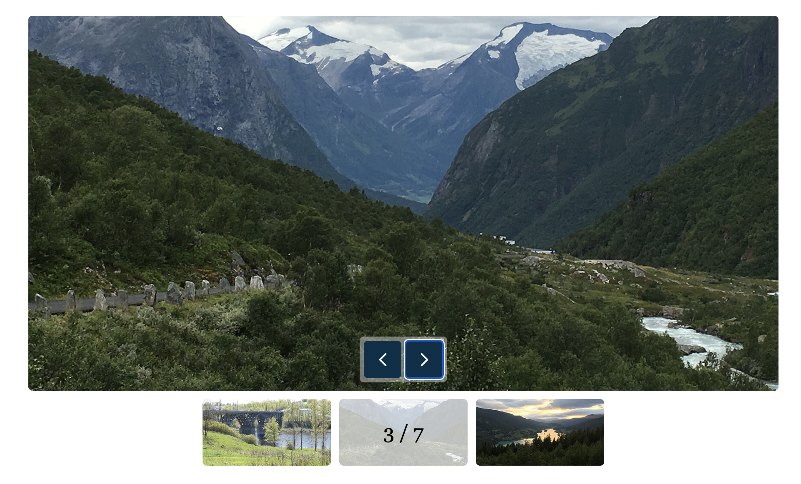

React (useState, useRef, useEffect) + TypeScript + Vite
1. Component App initializes the application and passes an array of photos to the 
WebPhotoGallery component. Each photo has an id, src (full image), preview (thumbnail), 
and description.
2. Component WebPhotoGallery is responsible for displaying the photo gallery, uses 
useState to manage the active photo index (indexActivePhoto), also includes navigation and 
preview gallery components.
3. Component Navigation provides navigation between photos with "Previous" and "Next" buttons,
buttons are disabled if there are no previous or next photos.
4. Component PreviewGallery displays previews of the photos and allows to select a photo 
by clicking on the previews of the photos. UseRef and useEffect manage the scrolling the previews 
of the photos.

